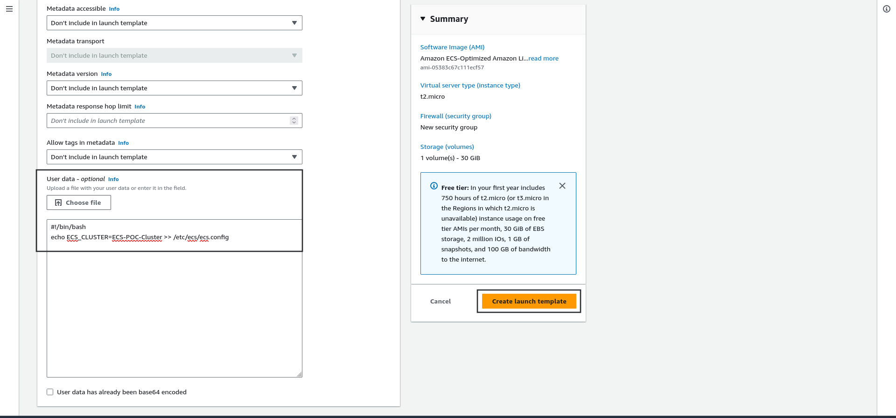

# Create and Configure ECS cluster.

## Requirements:
- AWS account.
- Privileges to modify IAM roles.

## Steps:
### Create ASG (Auto Scaling Group) for ECS.
- Create IAM role and attach following policies.  ***AmazonEC2ContainerRegistryPowerUser***, ***AmazonEC2ContainerServiceforEC2Role***, ***AmazonSSMManagedInstanceCore***.

    

- Search For EC2 and navigate to ***Launch Templates*** -> Click on ***Create Launch Template*** -> Give it a name, hit ***Browse more AMIs***, it should open another form.

    

- Search for ***ECS*** -> Filter by **Amazon Web Service** -> Select the highlighted image. This step is necessary because **NOT** every AMI is compatible and optimized for ECS.

    

- Select Instance type -> Key-Pair if you want to access EC2 instances via SSH.

    

- Scroll down -> In Network Settings block -> Create Security Group -> Select ***VPC*** (Note*: Select same VPC as the ALB) -> Add security group rule -> add ***32700-65535*** as **Port range** -> Add VPC CIDR as **Source**.

    

- ***Optional***: If you donot have Private Subnet with NAT Gateway then in that case we can enable **Auto Assign Public IP** so that the instances can have outbound network access. Otherwise keep it disabled.

    

- Scroll down -> Expand ***Advanced Details*** -> Under **IAM instance profile** select the ***ecsInstanceRole*** that we created.

    

- Scroll down -> Under ***User Data*** add following bash script -> Hit ***create launch template***. 

    **This step is very important as if not set then the ECS cluster will not be able to use the ASG as the Capacity Provider.*

    Change the \<ECS-Cluster-Name\> to the name of your cluster.

    ```bash
    #!/bin/bash
    echo ECS_CLUSTER=<ECS-Cluster-Name> >> /etc/ecs/ecs.config
    ```

    

- After creating launch template -> Select the created Launch Template -> Expand ***Actions*** hit ***Create Auto Scaling Group***.

    

- It will open a form -> In first page give it a name -> keep the selected Launch Template -> Hit ***next*** -> In next page Under Network block Select the proper ***VPC*** -> also select the appropriate ***availability zones and subnets*** -> Hit ***Next*** a couple of times and create the ASG. 

    

    ***Important***: keep in mind that the instances will be created within the mentioned subnets that are selected in above steps so use same subnets in the EFS creation and any other resource.

- ***Optional** After creating ASG -> Go to the ASG -> Under Launch template hit ***Edit***.
    
    

    Now hit ***override launch template*** under the **Instance type requirements** -> select ***Specify Instance attributes*** -> check the **No Maximum** in both vCPUs and Memory -> Under additional attributes select **CPU manufacturers** and hit ***Add Attributes*** -> select **AMD** and **Intel** under the **Choose CPU manufacturers** -> scroll down -> Put 100 in ***% spot*** box and 0 in ***% On-Demand***.

    

### Create ECS Cluster.
- Navigate to AWS console home -> search for ECS and hit ECS -> Select Create Cluster -> Give the ***same*** Cluster Name that we used in the Script passed in the User data -> Under Infrastructure uncheck AWS Fargate and check the ***Amazon EC2 Instances*** -> Under the ASG select the ***ASG*** we had created earlier -> Hit ***Create***.

    