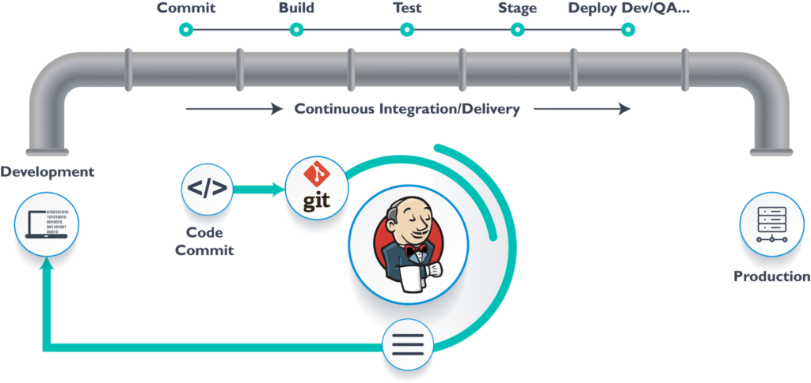
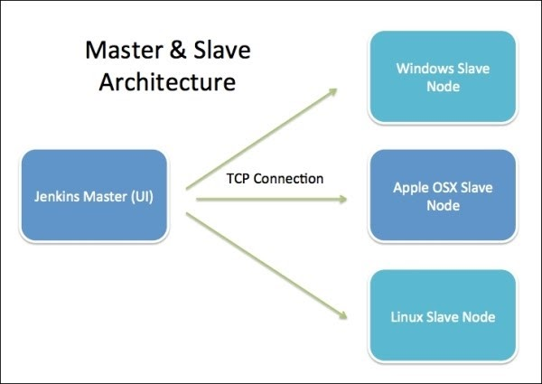

# Install Jenkins on a server and create a sample job.

## Requirements:

- Ubuntu server.
- JAVA (version 11 is used here.)

## Architecture:

- CI-CD and Jenkins:

  

- Jenkins Architecture:

  

## Steps:

- Create a server.(can be in cloud or on host machine)
  
  

- While creating network security group (NSG) open ports 80(http) and 8080(Jenkins).
  

- After deploying the VM/server take SSH access and install JAVA 11 (Important) and verify if java is installed correctly or not.

  ```bash
  sudo apt-get update
  sudo apt-get install openjdk-11-jdk
  java --version
  ```

  

- Now Install Jenkins. (either follow commands below or follow digitalocean guide [here](https://www.digitalocean.com/community/tutorials/how-to-install-jenkins-on-ubuntu-22-04).)

  ```bash
  wget -q -O - https://pkg.jenkins.io/debian-stable/jenkins.io.key |sudo gpg --dearmor -o /usr/share/keyrings/jenkins.gpg

  sudo sh -c 'echo deb [signed-by=/usr/share/keyrings/jenkins.gpg] http://pkg.jenkins.io/debian-stable binary/ > /etc/apt/sources.list.d/jenkins.list'

  sudo apt-get update

  sudo apt-get install jenkins
  ```

- Check whether jenkins is started or not.

  ```bash
  sudo systemctl status jenkins
  ```

  

- If it shows **inactive** then start the jenkins service.

  ```bash
  sudo systemctl start jenkins
  sudo systemctl enable jenkins
  ```

- Access jenkins by hitting `<public-ip>:8080` on the web browser. You should see similar page like below one.
  

- To unlock jenkins copy the default password given in path.

  ```bash
  sudo cat <path shown on getting started page>
  ```

  

- After that jenkins may ask you to install plugins, select install default/suggested plugins; and wait as it takes some time.
  

- Now either create new admin user or skip and use `admin` as default username and [`default-password`](Assets/Screenshot%20from%202023-01-25%2012-11-18.png) as password.
  

- Congrats! Now Jenkins is ready.
  
