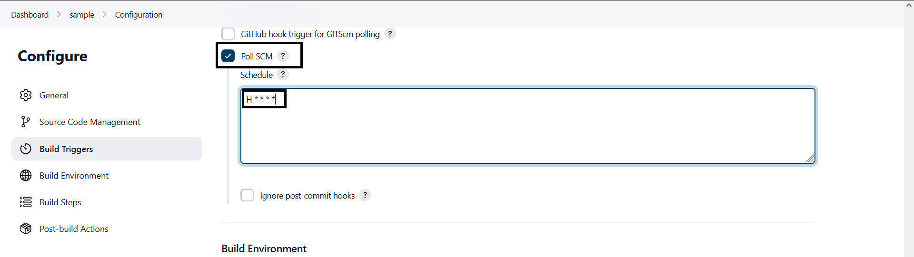

# Deploy PHP Web app on Azure Services using Jenkins.

## Requirements:

- Azure Subscription (Important).
- Jenkins installed on a server[.](1.11.1-Jenkins-Installation-On-Server.md)
- Sample project [repo.](https://github.com/fauzan1892/pos-kasir-php.git) (Fork the sample repo or use own PHP based repo)
- Azure MySQL Database (flexible) server.

## Steps:

- Fork and after that clone the sample repo on your local machine. After that open **config.php** file in any text editor and add your database information such as host, username, password, database-name (assuming that you have already created an empty database.) and save.
- After that push the code into your cloud repo.
- Now, install MySQL-client on your machine and restore the given .sql file into your created database.

  ```bash
  mysql -h <hostname.mysql.database.azure.com> -u <username> -p -D <database-name> < db_toko.sql
  ```

  \*Note: If your web app does not have ssl (http**s**) configured then, go to azure portal -> search for Azure mysql databse -> select your database -> Server Parameters -> filter by _require_ ->disable **require_secure_transport** -> click save.

  

- Assuming that you have jenkins installed on a VM in Azure. We have to configure private IP to be static.

  Search for Network interfaces in azure portal -> select Network Interface (it will list all NIC attached to compute services) -> Select one which is attached to your Jenkins Server -> Select **IP configurations** under settings -> Select **ipconfig** and under Priate IP adress Settings set assignmet to **static**.

- Now we have to create a service principal. For that user **must** atleast have **User Admin** role or **Owner** role. To check that go to **Azure Active Directory** -> Select Users -> Select your Display Name -> Select Assigned Roles.

  

- To create Service Principal, Go to Azure Active Directory and click on **App Registrations**.

  

- Select **New Registration**.

  

- Give **Name**, Supported account type, Redirect URI.

  

- After registering app go to overview tab and make note of **Client ID**, **Tenant ID** and select Certificates and Secrets.

  

- Add new Client secret, and fill description and Expiry.

  

- Note **Secret ID** with other IDs for later use.

  

- Go to **Authentication** and check **ID Tokens**

  

- Serach for **Subscriptions** and note your **subscription ID** for later use.

  

- Now go to your subscription (**Free Trial** in this example) -> Access Control(IAM) -> Add role assignment.

  

- Select **Owner** or **Contributor** Role and click next.

  

- Click **Select Members** -> Search for your **app name** and select created app.

  

- By Performing Above three steps we have given our **app service** permissions to create, delete, modify the resources in the entire **Subscription**. You can definitely give granular permissions by performing same steps on resource group or resources, etc.

- Jenkins Configuration: Go to Dashboard -> Manage Jenkins -> Configure System -> Jenkins Location. In that add _http://\<jenkins-vm-private-ip\>:8080/_ -> Save

  

- Go to Jenkins Dashboard -> Create a new item -> Under Source Code Management (SCM) select **Git** -> Add your forked repository URL -> Add your branch name in Branch Specifier.

  

- Scroll down to **Build Triggers** -> Check **Poll SCM** (It works like cron job and runs builds periodically) -> Add **H \* \* \* \***

  

- Scroll doen to **Build Steps** -> Add build step -> Execute Shell.

  

- Add following shell script in box.

  ```bash
  echo "Build Starts now"

  # Installing Azure-Cli with Dependencies
  curl -sL https://aka.ms/InstallAzureCLIDeb | sudo bash
  sudo apt install python3-pip -y
  sudo /usr/bin/pip3 install --system decorator

  # Signing into Azure using service principal credentials.
  az login --service-principal -u <Client-ID> -p <Client Secret> -t <Tenant-ID>

  # Creating (If new), updating (if already exist) web app.
  az webapp up -n <unique-app-name> --runtime "PHP:8.1" --os-type=linux --subscription <Subscription-ID-or-Name> -g <Resource-Group-Name> -l <Region> -p  <App-Service-Plan-Name>
  echo "Done!"

  # Signing Out. (Always a best practice.)
  az logout
  ```

  

- After that hit save and build now.

  

- Verify whether the build was successful or not.

  
