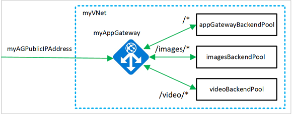

# Implementing Path Based Routing using Application Gateway in Azure.

## Requirements:

- Azure Account.
- Virtual Network with two subnets- Private Subnet and AG Subnet.
- Two VMs connected to a private subnet (Without any Public IP).
- Azure Storage Account.

## Working:

- Overview of How Path Based Routing can be done with Application Gateway in Azure.
  

## Steps:

- Similar to step 1 in [application gateway](4.1-Application-Gateway.md) search for application gateway.
- Basic configuration.
  
- Frontends.
  
- Backends.
  

- Routing Rules -> Listner.
  

- Routing Rules -> Backend Targets -> Backend Settings (Add new)
  

- Routing Rules -> Backend Targets
  

- Routing Rules -> Add mutliple targets to create path-based rule
  

- Check whether path based rules are added or not.
  

- Deploy.
  

- Check by hitting IP and IP/path.
  
  

- Insights.
  
