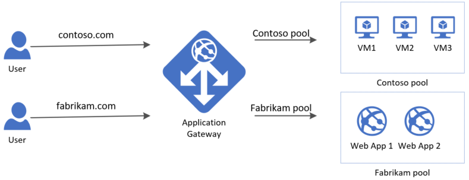

# Implementing Path Based Routing using Application Gateway in Azure.

## Requirements:

- Azure Account.
- Virtual Network with two subnets- Private Subnet and AG Subnet.
- Two VMs connected to a private subnet (Without any Public IP).
- Fully qualified Domain Name. (Important)

## Working:

- Overview of How Multisite Routing can be done with Application Gateway in Azure.
  

## Steps:

- Similar to [path based routing](4.2-Path-Based-Routing-Using-AG.md) setup basic configuration.
- Now rather than adding single listner add two separate listners with separate Hostname in hosts option..
  

- In backend setting add two entries, one for each backend pool; with hostnames.
- Now add (routing) rules, one for each listner.
  
  

- Verify by hitting both domain names.
  
  

- Insights.
  
