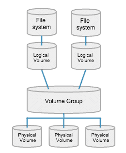

After booting into the arch-linux installer image, first check for internet connectivity useing "# ip addr" or ping.


If you can't see any IP or if you are using wlan or wireless network then we need to use utility called <ins>iwctl</ins>.

```bash
# To get into iwctl prompt
iwctl

# to list all the wireless adapters.
device list

# To initiate a scan for wireless networks also here instead of "wlan0" put your specific name which you have got from above command.
station wlan0 scan

# To list all thye scanned networks
station wlan0 get-networks

# To connect with the wireless network (wifi)
station wlan0 connect "name_of_wifi"
```

Then verify the boot mode.


## Setting up the disk partitions for UEFI.

First step is to check and note down the hard drive on which the OS will be installed. Which can be found by executing `lsblk`

In this case _/dev/sda_ is the hard drive.


After noting the disk name (path). Using said disk name enter into fdisk partiton table mode.
Using command: _# fdisk disk-name_


use print (p) command to print partition table.


and use _g_ to create a empty GPT partition table.


using _n_ command create partitions accordingly.


change the type of first partition type using _t_ command to EFI system.


similarly create new partition with all the remaining space.

and change type of said partiton to 'Linux LVM'. _note: always use L command to list all the types since the id for various types tend to change as new types are being added regularly._


after partitioning the table should look like this:


and to write the changes just simply put _w_ command


### Formatting the partitions

First format the EFI partition (sda1) to fat32.

```bash
mkfs.fat -F32 /dev/sda1
```


Now, to configure [LVM](https://www.thegeekdiary.com/redhat-centos-a-beginners-guide-to-lvm-logical-volume-manager/)



first create the physical volume

```bash
# here put your partiton path; not the 500MB one the other one.
pvcreate --dataalignment 1m /dev/sda2
```

<ins>**Note:**</ins> If you get error such as `No evice found at /dev/sda2` reboot the machine and check if the partitons are there or not with help of `lsblk` command and then continue the process.


Then, create the volume group.

```bash
# Here put any name in place of "volgroup0"
vgcreate volgroup0 /dev/sda2
```


After volume group, create logical volumes. Here we will be creating separate logical volumes one for root and another for home partition.

<ins>**Note:**</ins> If you only want one lv with all the storage then use second command from below with `100%FREE` in command.

```bash
# To create logical volume for root
lvcreate -L 20GB volgroup0 -n lv_root

# To create home lv
lvcreate -l 100%FREE volgroup0 -n lv_home
```


Then use modprobe to load required kernel modules.

```bash
modprobe dm_mod
```


At last, using _vgchange_ we will activate the logical volumes so that we can mount them.

```bash
vgchange -ay
```


Then format the logical volumes.

```bash
mkfs.ext4 /dev/volgroup0/lv_root

mkfs.ext4 /dev/volgroup0/lv_home
```


now mount the volumes to respective paths in _/mnt_

```bash
mount /dev/volgroup0/lv_root /mnt
```


```bash
mkdir /mnt/home
mount /dev/volgroup0/lv_home /mnt/home
```


Now, generate and configure _fstab_

```bash
mkdir /mnt/etc
genfstab -U -p /mnt >> /mnt/etc/fstab
```


Generated _fstab_ file should look similar to this one below:


<ins>**DO NOT REBOOT UNTIL THE DESKTOP ENVRONMENT IS INSTALLED!!!**</ins>
