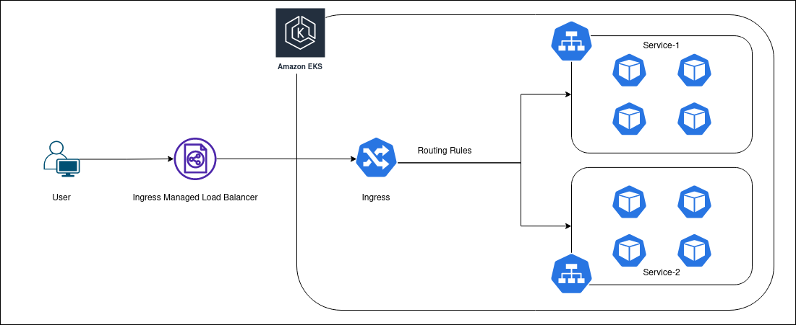

# EKS Kubernetes Ingress.

## Requirements:

- Working EKS Deployment.

<br />

## What is Ingress?



Ingress helps us to Balance load coming into the cluster also we can add certain **Routing Rules**
for better traffic distribution in the services.
One more advantage of Ingress is that we can attach ssl on ingress itself by passing tls.crt (fullchain certificate) and tls.key (Privkey) as secrets to the ingress service.

<br />

## Creation and Deployment of Nginx Ingress Controller and Ingress Service.

### Requirements:

- FQDN (Fully Qualified Domain Name) for any Domain Registrar. (godaddy, FreeNom, etc.)

### Steps:

- (**\*Only if worpress is deployed**) First since we have deployed Wordpress on EKS migrating to a new domain is not that simple; we have to change some settings. Go to Wordpress Admin Page -> Settings -> General -> change Wordpress Site Address (URL) and Site Address (URL) to your FQDN and save.
  

- Now we first have to Deploy Nginx Ingress Controller to our EKS Cluster.

  ```bash
  kubectl create namespace ingress-nginx
  kubectl apply -f https://raw.githubusercontent.com/kubernetes/ingress-nginx/controller-v1.1.0/deploy/static/provider/aws/deploy.yaml
  ```

  

- After Deploying Nginx Ingress Controller we can now deploy our ingress services.

- Now to attach SSL we have to pass our fullchain cetrtificate and privkey as secrets in EKS. This can be done in two ways, first one we directly create the secrets with `kubectl create secret` command as we done befor while passing AWS credentials into EKS, second way is to pass secrets in yaml file. We will use second method here. (**\*Only create Secret if you wish to configure SSL else Skip this step**)

- First Encode fullcain.pem and privkey.pem into base64 format.

  ```bash
  cat fullchain.pem | base64 -w 0
  cat privkey.pem | base64 -w 0
  ```

- Add the encoded string as values in secrets file. (secrets.yaml)

  ```yaml
  apiVersion: v1
  kind: Secret
  metadata:
    name: <secret-name>
    namespace: <Your Namespace>
  type: Opaque
  data:
    tls.crt:
    <fullchain.pem in encoded format>

    tls.key:
    <privkey.pem in encoded format>
  ```

- Now create a new file named ingress.yaml (file name can be anything), and add following configurations.

  ```yaml
  apiVersion: networking.k8s.io/v1
  kind: Ingress
  metadata:
    name: <ingress-name>
    namespace: <Your Namespace>
    annotations:
      # Ommit this if you are not adding SSL
      nginx.ingress.kubernetes.io/ssl-redirect: "true"
      # ....
      kubernetes.io/ingress.class: "nginx"
  spec:
    # This Section can be ommitted if you donot want to add ssl starting here...
    tls:
      - hosts:
          - <youre-domain-name-without-http-or-https>
        secretName: <secret-name>
    # Ends here...
    rules:
      - host: <youre-domain-name-without-http-or-https>
        http:
          paths:
            - path: /
              pathType: Prefix
              backend:
                service:
                  name: <wordpress-service-name> # Here you must add the service name on which you want to attach ingress, in this case I want to access my Wordpress through ingress.
                  port:
                    number: 80
  ```

- After this deploy this ingress service with following Command.

  ```bash
  kubectl create -f ingress.yaml
  ```

  

- Now get ingress service IP/URL.

  ```bash
  kubectl get ingress <ingress-name>
  ```

- If output in an URL (Load Balancer, which is most likely will be the case) then got ot your domain settings (e.g. godaddy in this case) and add **CNAME** Record add name as your subdomain (here **wp**) and add value as Load Balancer URL. If the output in an IP the add **A** Record with same name and value as the IP.

- Now try to access the site with Domain Name.
  
