# Setup Kubernetes Cluster using Kubeadm

## Requirements:

- Ubuntu machines (any other distribtion can be used but for simplicity we will use ubuntu here; <ins>Ubuntu 22.04</ins> to be specific)
- Minimum 2 core CPU and 2GB RAM and 20GB of Storage.

## Lab Setup:

| Node Name  | Role                   | Domain     |
| ---------- | ---------------------- | ---------- |
| k8s-master | control-plane (Master) | k8s-master |
| k8s-node-1 | Worker Node-1          | k8s-node-1 |
| k8s-node-2 | Worker Node-2          | k8s-node-2 |

---

## Pre-requisites:

- <ins>**Set Hostnames for each nodes and master**</ins>: We can set hostname so that we can easily identify all the nodes.

  ```bash
  # Run with sudo or as root user.
  hostnamectl set-hostname k8s-master

  # Similarly run command on all the nodes as well; e.g.
  hostnamectl set-hostname k8s-node-1
  ```

- <ins>**Add node entries in hostfile of all node machines**</ins>: This one is quite important as it will give us an option to use names instead of machine ip addresses.

  Add entries like this in `/etc/hosts` file. (Do this setp for all the machines.)

  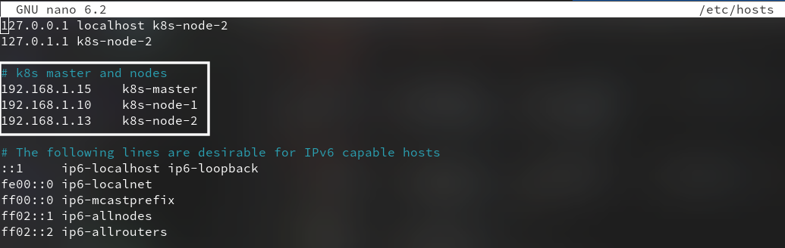

- <ins>**Disable swap & Add kernel Parameters**</ins>: Run following commands to turn off swap on all the nodes along with master machine.

  ```bash
  sudo swapoff -a
  sudo sed -i '/ swap / s/^\(.*\)$/#\1/g' /etc/fstab

  # Load the following kernel modules on all the nodes
  sudo tee /etc/modules-load.d/containerd.conf <<EOF
  overlay
  br_netfilter
  EOF

  sudo modprobe overlay
  sudo modprobe br_netfilter

  # Set the following Kernel parameters for Kubernetes, run beneath tee command
  sudo tee /etc/sysctl.d/kubernetes.conf <<EOF
  net.bridge.bridge-nf-call-ip6tables = 1
  net.bridge.bridge-nf-call-iptables = 1
  net.ipv4.ip_forward = 1
  EOF

  # Reload the above changes
  sudo sysctl --system
  ```

- Install Containerd Runtime (CRI) here we used containerd.

  ```bash
  # Install its dependencies
  sudo apt install -y curl gnupg2 software-properties-common apt-transport-https ca-certificates

  # Enable docker repository
  sudo curl -fsSL https://download.docker.com/linux/ubuntu/gpg | sudo gpg --dearmour -o /etc/apt/trusted.gpg.d/docker.gpg
  sudo add-apt-repository "deb [arch=amd64] https://download.docker.com/linux/ubuntu $(lsb_release -cs) stable"

  # Install containerd
  sudo apt update
  sudo apt install -y containerd.io

  # Configure containerd so that it starts using systemd as cgroup.
  containerd config default | sudo tee /etc/containerd/config.toml >/dev/null 2>&1
  sudo sed -i 's/SystemdCgroup \= false/SystemdCgroup \= true/g' /etc/containerd/config.toml

  # Enable and start containerd service
  sudo systemctl enable containerd --now
  sudo systemctl status containerd
  ```

## Setup Kubeadm:

### Install Kubectl, Kubeadm and Kubelet:

- Install dependencies:

  ```bash
  sudo apt-get update

  # apt-transport-https may be a dummy package; if so, you can skip that package
  sudo apt-get install -y apt-transport-https ca-certificates curl gpg
  ```

- Add the appropriate Kubernetes apt repository. Please note that this repository have packages only for Kubernetes **_1.28_**; for other Kubernetes minor versions, you need to change the Kubernetes minor version in the URL to match your desired minor version (you should also check that you are reading the documentation for the version of Kubernetes that you plan to install).

  ```bash
  # This overwrites any existing configuration in /etc/apt/sources.list.d/kubernetes.list
  echo 'deb [signed-by=/etc/apt/keyrings/kubernetes-apt-keyring.gpg] https://pkgs.k8s.io/core:/stable:/v1.28/deb/ /' | sudo tee /etc/apt/sources.list.d/kubernetes.list
  ```

- Update the apt package index, install kubelet, kubeadm and kubectl, and pin their version:

  ```bash
  sudo apt-get update
  sudo apt-get install -y kubelet kubeadm kubectl
  sudo apt-mark hold kubelet kubeadm kubectl
  ```

### Initialize Kubernetes Cluster with Kubeadm and add Nodes to the cluster.

- Execute following command in the <ins>**master node**</ins> only to initialize the control plane.

  ```bash
  # Here if you have used any other name of used FQDN for master node add that instead of 'k8s-master' as the endpoint.
  sudo kubeadm init --control-plane-endpoint=k8s-master
  ```

  It should yeild following message upon successful execution along with the instructions to add the nodes and add kubeconfig. <ins>_Take a note of the command highlighted and save it somewhere safe as we will be using this command in upcoming steps_</ins>.

  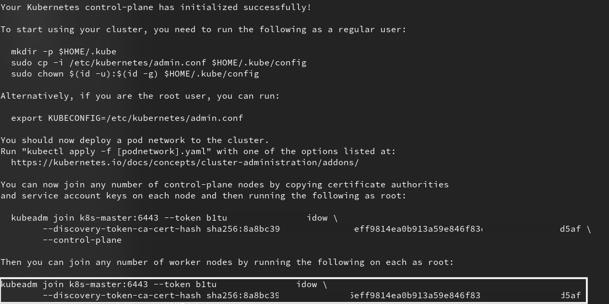

- Now to add the nodes to your kubernetes cluster execute the command provided in the output of the `kubeadm init` command which we have saved in all the <ins>**other nodes**</ins> only. Upon successful execution it should give following output.

  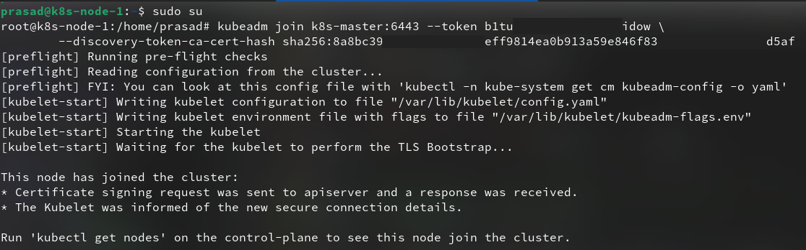

### Configure kubectl:

- To interact with the K8s cluster we have just created we need some kind of tool, here we have already installed kubectl in the master node we will configure kubectl in this node as the config file is generated here. Execute following commands as the user.

  ```bash
  mkdir -p $HOME/.kube
  sudo cp -i /etc/kubernetes/admin.conf $HOME/.kube/config
  sudo chown $(id -u):$(id -g) $HOME/.kube/config
  ```

  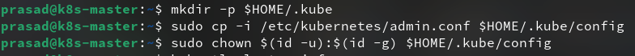

  <ins>**Note**:</ins> To use the kubectl in your local machine you can copy trhe contents of the file `/etc/kubernetes/admin.conf` located in the **master node** and save at `$HOME/.kube/config` in your local machine. The only condition here is that the cluster should be accessible from your local machine in any way possible.

- After configuring the kubectl we can check if it has been configured or not properly by executing following ccommand

  ```bash
  kubectl cluster-info
  ```

  It will print output similar to this

  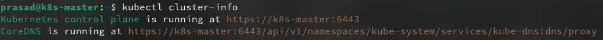

- Now to check whether the nodes are attached or not.

  ```bash
  kubectl get nodes
  ```

  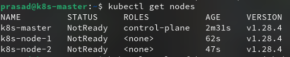

  This command will yeild result with the status as **Not Ready** it is expected as we haven't installed the <ins>**Network Driver**</ins> yet!

- Install Calico Network Driver

  ```bash
  kubectl apply -f https://raw.githubusercontent.com/projectcalico/calico/v3.25.0/manifests/calico.yaml
  ```

  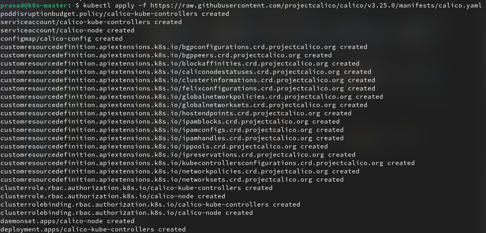

- Verify if the calico driver is successfully installed and working as expected.

  ```bash
  kubectl get pods -n kube-system
  ```

  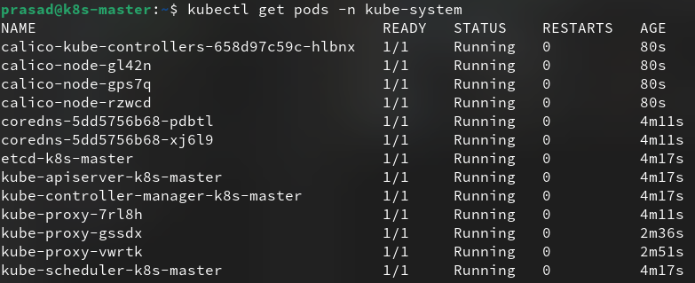

  Wait till all the <ins>calico pods</ins> are in the running state as shown in the image above.

- Now if you execute the `kubectl get nodes` command it will show all the nodes and their status as <ins>_Ready_</ins>

  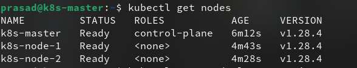

- Now our basic setup is ready and we can now assign various roles to the nodes and can eploy our workloads in the cluster.

## Bonus:

### Deploy simple nginx in the cluster:

- Create simple deployment of nginx.

  ```bash
  kubectl create deployment nginx-app --image=nginx --replicas=2
  ```

  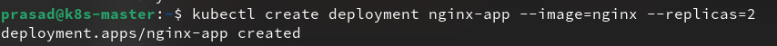

- Verify if the deployment is done successfuly or not.

  ```bash
  kubectl get all
  ```

  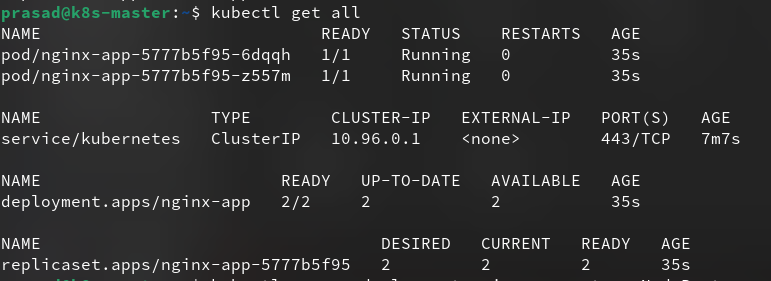

  Wait till the pods are in running state and the deployment is ready.

- Expose the nginx service.

  ```bash
  kubectl expose deployment nginx-app --type=NodePort --port=80

  # Take note of the port in the output
  kubectl describe svc nginx-app
  ```

  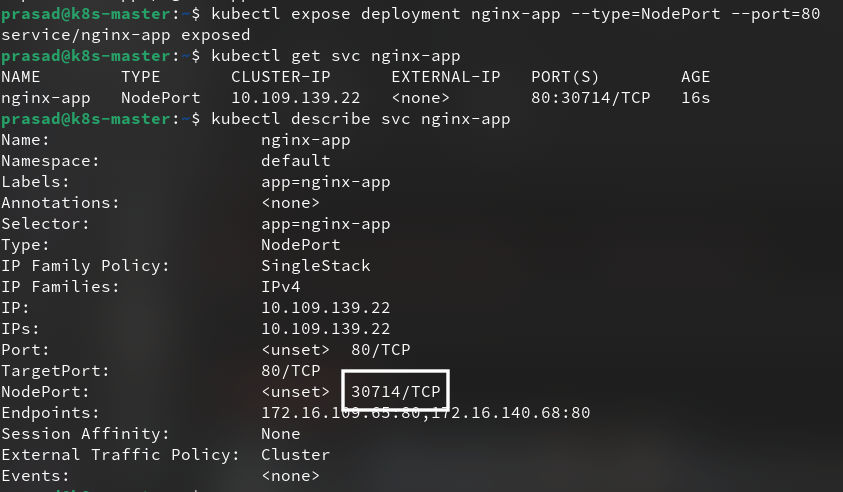

  Now you can access the nginx service deplyed using the <ins>**node-ip:port**</ins> either on the browser or curl request.

  The output should look like this.

  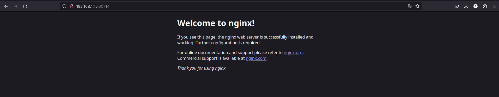

Congratulations! you have successfully configured K8S cluster and have deployed app on the cluster.

## References:

- https://kubernetes.io/docs/setup/production-environment/tools/kubeadm/install-kubeadm/
- https://www.linuxtechi.com/install-kubernetes-on-ubuntu-22-04/#3_Install_Containerd_Runtime
