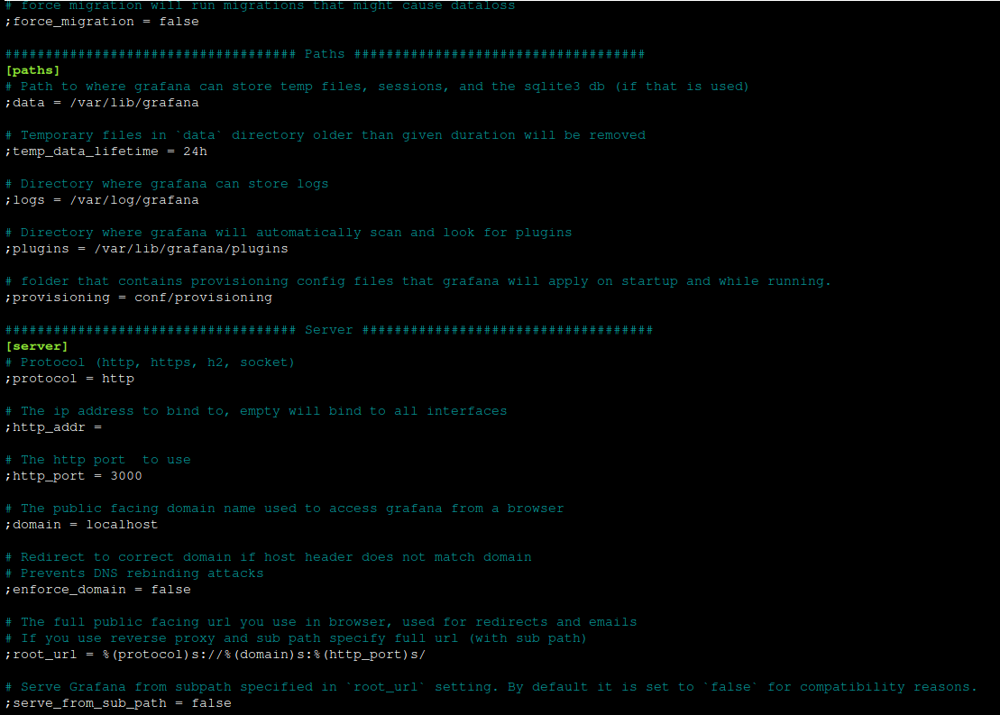

# Monitoring Setup With Grafana Loki and Fluentbit.

## Requirements:
- Any Linux based Machine (used Ubuntu 20.04 here).
- S3 bucket with sufficient permissions.


## Installing Grafana:
### Steps:
- In this demo we will be installing Grafana in Ubuntu which is also valid for Debian. Please refer [official doc](https://grafana.com/docs/grafana/latest/setup-grafana/installation) for any other Linux Distro.
- Install the prerequisite packages:
    ```bash
    sudo apt-get install -y apt-transport-https software-properties-common wget
    ```
- Import the GPG key:
    ```bash
    sudo mkdir -p /etc/apt/keyrings/
    wget -q -O - https://apt.grafana.com/gpg.key | gpg --dearmor | sudo tee /etc/apt/keyrings/grafana.gpg > /dev/null
    ```
- To add a repository for stable releases, run the following command:
    ```bash
    echo "deb [signed-by=/etc/apt/keyrings/grafana.gpg] https://apt.grafana.com stable main" | sudo tee -a /etc/apt/sources.list.d/grafana.list
    ```
- Run the following command to update the list of available packages:
    ```bash
    # Updates the list of available packages
    sudo apt-get update
    ```
- To install Grafana OSS, run the following command:
    ```bash
    # Installs the latest OSS release:
    sudo apt-get install grafana
    ```

## Configure Grafana:
### Steps:
- We can ommit this step if the motive is just to get started with grafana, in that case we can access the grafana on ***localhost:3000*** or ***<server_ip>:3000***
- If you installed Grafana using the deb or rpm packages, then your configuration file is located at /etc/grafana/grafana.ini and a separate custom.ini is not used. This path is specified in the Grafana init.d script using --config file parameter.
- Here We will be changing some basic configuration parameters.
- We can change root URL if we want grafana to use our desired URL.

    
- Also we can change log path if we want. 
- There are alot of different parameters that we can change; please refer [documentation](https://grafana.com/docs/grafana/latest/setup-grafana/configure-grafana) for more insight.
- Important** Run following command to restart Grafana service if any configurations are changed.
    ```bash
    systemctl restart grafana-server
    ```
- To add any datasource such as Prometheus/Loki or Cloudwatch we can utilize connections which we will perform in upcoming steps.