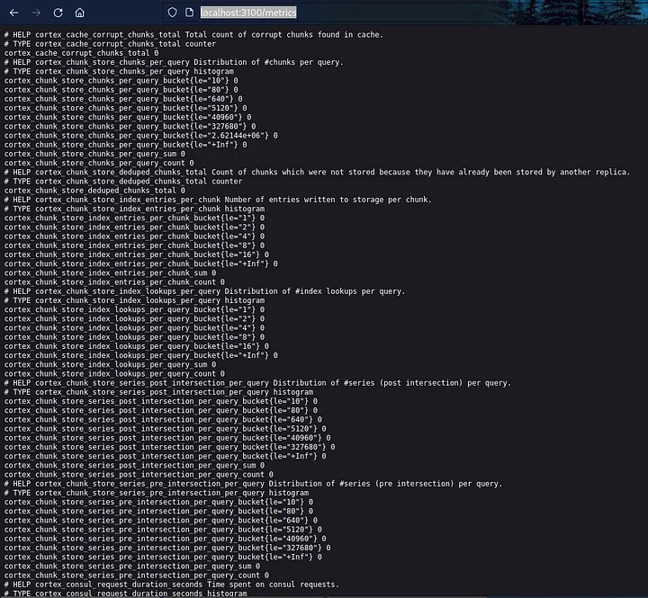
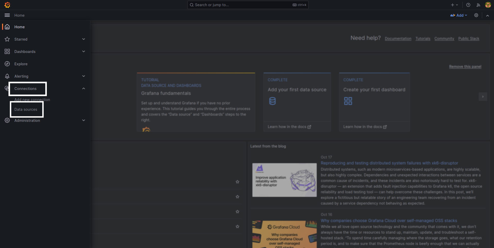
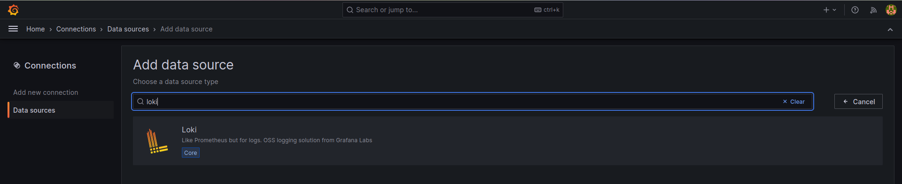
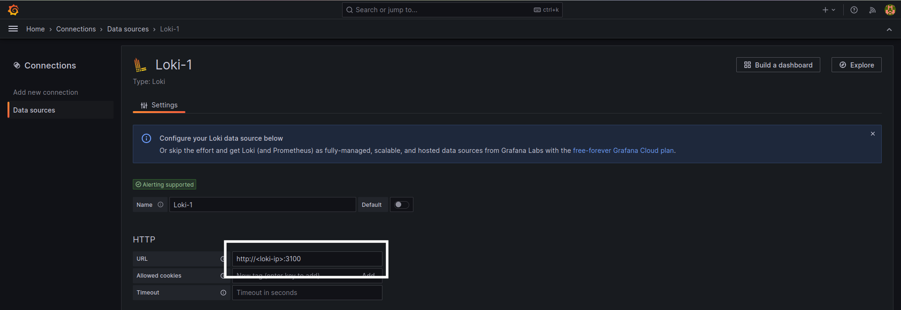

# Installing Loki and integrating Loki with Grafana.

## Requirements:
- Grafana Installed. Please refer [this doc for grafana Installation and setup](./01_Install_Grafana.md).
- Sufficient S3 permissions (Either use instance IAM roles if using EC2 or use IAM credentials with sufficient permissions). Required permissions are: *s3:ListBucket*, *s3:PutObject*, *s3:GetObject*, *s3:DeleteObject* (if running the Single Store (boltdb-shipper) compactor). Resources: *arn:aws:s3:::<bucket_name>*, *arn:aws:s3:::<bucket_name>/**

## Steps:
- Download the binary from the Loki Github repo.
    ```bash
    curl -O -L "https://github.com/grafana/loki/releases/download/v2.8.6/loki-linux-amd64.zip"
    unzip "loki-linux-amd64.zip"
    chmod a+x "loki-linux-amd64"
    ```
- After Downloading it copy the binary to */usr/local/bin*
    ```bash
    sudo cp loki-linux-amd64 /usr/local/bin/loki
    
    #verify installation by checking version
    loki --version
    ```
- Create Loki Service file so that we can execute loki as systemd process.
    ```bash
    #create user for loki
    sudo useradd --system loki
    
    #create dir in /etc
    sudo mkdir -p /etc/loki /etc/loki/logs
    
    #default loki config file
    ```

- Create a configuration file which will use S3 as backend storage for loki indices.
    ```bash
    sudo nano /etc/loki/loki-config.yaml
    ```
- Add following configurations. **Note*** Only change the storage part.
    ```yaml
    auth_enabled: false
    server:
      http_listen_port: 3100
      grpc_listen_port: 9096

    ingester:
      wal:
        enabled: true
        dir: /tmp/wal
      lifecycler:
        address: 127.0.0.1
        ring:
          kvstore:
            store: inmemory
          replication_factor: 1
        final_sleep: 0s
      chunk_idle_period: 1h       # Any chunk not receiving new logs in this time will be flushed
      max_chunk_age: 1h           # All chunks will be flushed when they hit this age, default is 1h
        #chunk_target_size: 1048576  # Loki will attempt to build chunks up to 1.5MB, flushing first if chunk_idle_period or max_chunk_age is reached first
      chunk_target_size: 209715200
      chunk_retain_period: 30s    # Must be greater than index read cache TTL if using an index cache (Default index read cache TTL is 5m)
      max_transfer_retries: 0     # Chunk transfers disabled

    schema_config:
      configs:
        - from: 2020-10-24
          store: boltdb-shipper
          object_store: s3
          schema: v11
          index:
            prefix: index_
            period: 24h

    storage_config:
      boltdb_shipper:
        active_index_directory: /tmp/loki/boltdb-shipper-active
        cache_location: /tmp/loki/boltdb-shipper-cache
        cache_ttl: 24h         # Can be increased for faster performance over longer query periods, uses more disk space
        resync_interval: 5s
        shared_store: s3
      aws:
    # Change following 2 values
        region: <aws_region>
        bucketnames: <bucket_name>
        s3forcepathstyle: true

    compactor:
      working_directory: /tmp/loki/boltdb-shipper-compactor
      shared_store: filesystem

    limits_config:
      retention_period: 72h
      enforce_metric_name: false
      reject_old_samples: true
      reject_old_samples_max_age: 168h
      max_cache_freshness_per_query: 10m
      split_queries_by_interval: 15m
      # for big logs tune
      per_stream_rate_limit: 512M
      per_stream_rate_limit_burst: 1024M
      cardinality_limit: 200000
      ingestion_burst_size_mb: 1000
      ingestion_rate_mb: 10000
      max_entries_limit_per_query: 1000000
      max_label_value_length: 20480
      max_label_name_length: 10240
      max_label_names_per_series: 300
      max_query_series: 100000

    chunk_store_config:
      max_look_back_period: 0s

    table_manager:
      retention_deletes_enabled: false
      retention_period: 0s

    ruler:
      storage:
        type: local
        local:
          directory: /tmp/loki/rules
      rule_path: /loki/rules-temp
      alertmanager_url: http://localhost:9093
      ring:
        kvstore:
          store: inmemory
      enable_api: true

    query_scheduler:
    max_outstanding_requests_per_tenant: 2048
    ```
- Configure Loki to run as a service.
    ```bash
    #change permissions
    sudo chown -R loki: /etc/loki

    #Create a file called loki.service
    sudo vi /etc/systemd/system/loki.service
    ```
- Add following script in the loki.service file
    ```bash
    [Unit] 
    Description=Loki service 
    After=network.target 
 
    [Service] 
    Type=simple 
    User=loki 
    ExecStart=/usr/local/bin/loki -config.file /etc/loki/loki-config.yaml 
    Restart=on-failure 
    RestartSec=20 
    StandardOutput=append:/etc/loki/logs/loki.log 
    StandardError=append:/etc/loki/logs/loki.log 
 
    [Install] 
    WantedBy=multi-user.target
    ```

- Run following commands to start Loki service.
    ```bash
    sudo systemctl daemon-reload
    sudo systemctl enable loki --now
    sudo systemctl status loki
    ```

- To Check metrics received by loki. Open browser and type below address.
    ```bash
    http://<server_ip>:3100/metrics
    ```

### Output:



### Integrating Loki with Grafana.
- Open Grafana in browser -> Navigate to Connections -> Select Data Sources.

    

- Select "Add new data source"
- Search for "Loki" -> Select Loki.

    

- Add loki URL in the *URL* section:
    

- Select ***Save & Test***.