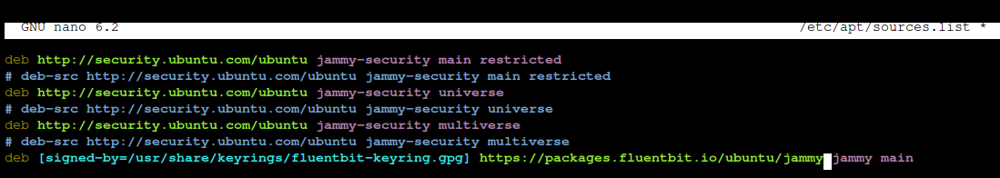
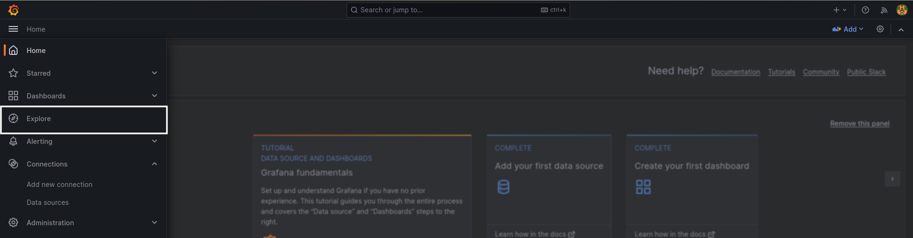
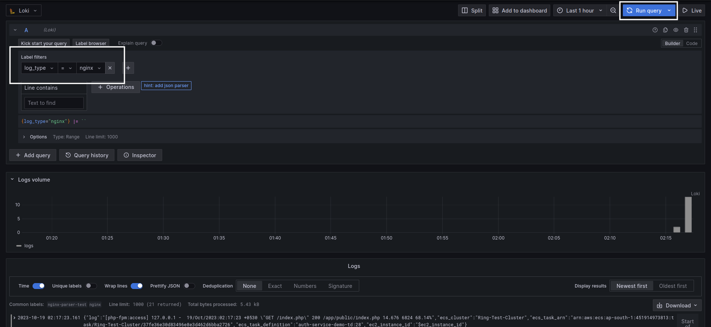

# Installing fluent-bit and send logs to Loki.

*Note**: The Fluentbit is a **log shipper** which means that it should **always** run alongside with the actual application and not in the loki or grafana server as it is like an on-field worker which will send the logs to the loki, Elasticsearch, etc.

## Requirements:
- Working Grafana and Loki setup. (refer [this for grafana](./01_Install_Grafana.md) and [this for loki](./02_install_loki.md)).


## Steps:
### Installing Fluentbit in the EC2 instance (or any machine) running Ubuntu.
- Add Server GPG key.
    ```bash
    curl https://packages.fluentbit.io/fluentbit.key | gpg --dearmor > /usr/share/keyrings/fluentbit-keyring.gpg
    ```
- On Ubuntu, you need to add our APT server entry to your sources lists, please add the following content at bottom of your /etc/apt/sources.list file.
**Note:** Ensure to set CODENAME to your specific [Ubuntu Release Name](https://wiki.ubuntu.com/Releases). Assuming that we are running Ubuntu 22.04 we will use *jammy* here.
    ```bash
    nano /etc/apt/sources.list
    deb [signed-by=/usr/share/keyrings/fluentbit-keyring.gpg] https://packages.fluentbit.io/ubuntu/jammy jammy main
    ```
    It should look something like this.
    
    

- Update your repositories database
    ```bash
    sudo apt-get update
    ```

- Install Fluentbit.
    ```bash 
    # If you have the following error "Certificate verification failed"
    sudo apt-get install ca-certificates

    # Install and enable fluentbit
    sudo apt-get install fluent-bit
    sudo systemctl enable fluent-bit --now

    # Check if the fluent-bit is running or not.
    sudo systemctl status fluent-bit
    ```

### Configuring fluentbit.
- Navigate to */etc/fluent-bit* where the fluentbit configuation file is present.
    ```bash
    cd /etc/fluent-bit
    nano fluent-bit.conf
    ```
    Considering that the logs we want are in the *.log* files and not console out we can use *tail* input option. Add following block below first input block.
    ```yaml
    [INPUT]
    name    tail                    # name of the plugin
    path    /var/log/apache/*.log   # Log files path
    # Unique label which will differentiate between multiple inputs; and will be used in Output block.
    tag     apache.logs             
    Skip_Long_Lines     Off         # If the log lines are larger than default.

    [INPUT]
    name    tail
    path    /var/log/nginx/*.log
    tag     nginx.logs              # Different for apache and nginx
    Skip_Long_Lines     Off
    ```

    Now we will add new fileds to the log file so that we can differentiate them in the Loki-Grafana.

    ```yaml
    [FILTER]
    # The function which will allow us to add/remove any field inside the log entry.
    Name    modify           
    # Identifier which will inherit all the modifications. Should regex match with the TAG we used in the input section.   
    Match   apache.logs*    
    # Actual instruction; in this case it will Add new field named log_type with value "apache"    
    Add     log_type   apache

    [FILTER]
    Name    modify
    Match   nginx.logs*
    Add     log_type   nginx
    ```

    Now we will add output block similar to Input we can add multiple Output blocks. Here we will add two different blocks one for loki server running on default port (3100) another one is for loki running behind SSL on port 443.

    ```yaml
    [OUTPUT]
    name                   loki
    Match                  *.logs*
    host                   <loki-server-ip>
    port                   3100
    label_keys             $log_type
    labels                 job=fluentbit
    log_type=nginx

    [OUTPUT]
    name                   loki
    Match                  *.logs*
    host                   <loki-domain>
    port                   443
    tls                    on
    tls.verify             on
    label_keys             $log_type
    labels                 job=fluentbit
    ```

- After changing restart the fluent-bit service.
    ```bash
    sudo systemctl restart fluent-bit
    sudo systemctl status fluent-bit

    # If the fluentbit fails to start
    journalctl -u fluent-bit -r # or use -f instaed of -r for live logs
    ```

- If everything is configured we should see new labels in the grafana explore. For that access grafana in browser and select Explore option.
    

- Here select *job* as the label and *fluentbit* as value and Run query. Or we can also select *log_type* as label and *apache* or *nginx* for those specific logs.
    

