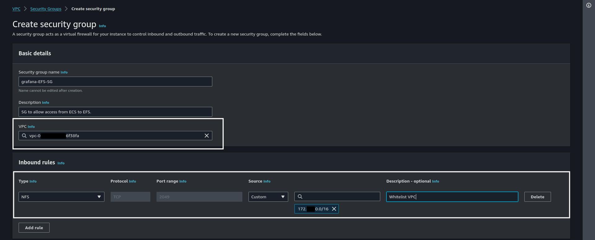
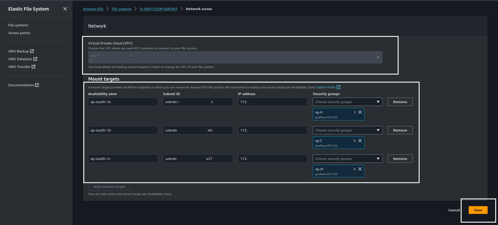
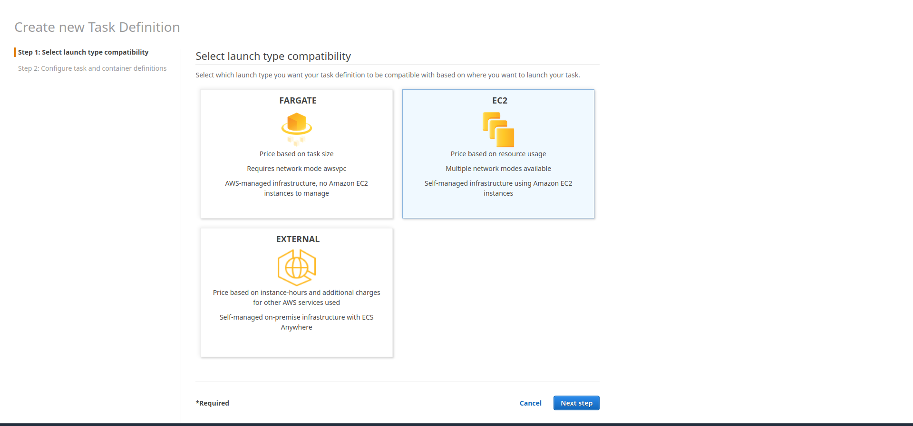

# Deploying Grafana With Persistent Storage in ECS.

## Requirements:
- AWS account.
- Privileges to modify IAM roles.
- Working ECS Cluster.
- Either EC2 instances with *Public IP* configured or if EC2 instances are private *ALB* within the ECS cluster.

## Steps:
### Create EFS (Elastic File System) to store Grafana Data.
- Navigate to EFS in AWS console.
- Select ***Create File System***.
- Give it appropriate name and select VPC. It is important to select VPC in which our ECS cluster lies.
- Now navigate to VPC and select Security Groups.
- Add new security group. Select Same VPC that we selected in the EFS creation form -> Under Inbound Rule section click ***Add Rule*** -> In type search for ***NFS*** -> In source add VPC CIDR block so that only Resources in VPC can access EFS. -> Click ***Create Security Group***.

    

- Navigate back to EFS that we created -> Network -> Manage -> Select VPC -> Add Mount target -> Select Availability Zone -> Subnet Id -> Security Group. Add mount targets according to the Number of Availability Zones you have. Here we have 3 availability zones so we will add 3 -> Hit ***Save***.

    

### Deploy Grafana.
#### Create Task Definition For Grafana.
- Navigate to ECS -> On left hand pane Select Task Definitions -> Create New task Definition
- Under Select launch type compatibility select appropriate Launch type, Assuming that we are using ***ASG (Auto Scaling Group as Capacity Provider in the ECS cluster)*** we will select ***EC2*** -> Hit ***Next Step***.

    

- In the next step we will Configure task and container definitions. 
- In the form add appropriate information. Name -> Task Role -> In network mode select ***Bridge Mode*** -> Task Execution Role (use default role or create a new IAM role and use that; but make sure if you are using new IAM role select **Configure task and container definitions** as use case under **Elastic Container Service**)

    

    Scroll all the way down and select ***Add Volume*** under Volumes section -> Give appropriate name for the volume mount -> Select ***EFS*** as volume type -> Select EFS that we created earlier in the ***File System ID*** -> Mention Root Directory -> Click ***Add***

    

    After this scroll up and under Container Definitions select ***Add Container*** -> A new form will appear -> here give appropriate Container name -> Add docker image name -> in Memory Limits select ***Soft limit*** and set memory accordingly for this demo we will set it as ***1024*** which is 1GiB -> Under port mappings put 3000 as ***Container Port*** as it is the default port of grafana and either put specific port number as ***Host Port*** if you are using EC2 instances with Public IP and **NOT** utilizing ALB but we will be attaching it to ALB so we will set it to 0 which will set the host port dynamically.

    

    Scroll Down -> Under Environment Section put ***CPU units*** as 1024 (1 Core is minimum requirement for Grafana.) -> Add Environment variables/Env files from S3 if needed; we can manage/configure any grafana parameter using environment variables refer [this](https://grafana.com/docs/grafana/latest/setup-grafana/configure-grafana/#override-configuration-with-environment-variables) for more info.

    

    Scroll Down -> Under Storage and Logging -> Select the EFS Volume we have created in the Volumes -> Add ***/var/lib/grafana*** as the ***container path*** -> And check the ***Auto-configure CloudWatch Logs*** box so that ECS can automatically configure Log options -> Hit ***Update***.

    

    Scroll down and hit ***Create***.

#### Deploy Grafana ECS Service.
- Navigate to your ECS cluster and Under the ***Services*** tab hit on ***Create***.
- It will open a new page where we will configure the service. Select Appropriate Cluster Provider Strategy (if only one exists then It will automatically select that) -> Select task Definition that we created earlier -> It will automatically select latest revision -> Cluster Name -> Give appropriate Service name -> and put desired number of task -> keep everything else default and hit ***next step***. (If you know about blue-green deployments you can select it and configure it further but for this demo we will keep rolling update)

    

    In next page Select ALB (if you are using EC2 Instances with Public IP keep it to ***None***) -> Keep service IAM role default -> Select Load Balancer Name -> Under Container to load balance hit ***Add to load balancer*** (if the task definition contains multiple port mappings or multiple containers with port mapping then select the appropriate one.) -> It should then expand to a new set of configurations.

    

    In the production listener port select the listener port you have in the ALB -> If a target group is already created use that or select create new target group and give it an appropriate name -> Mention ***Target Group Protocol*** as **HTTP** -> keep path pattern same as we will edit that afterwards in the ***ALB Listener Rule*** -> Put Health check path as ***/api/health*** which is default health check path of Grafana -> Hit ***next step*** a couple of times and hit ***Create Service***.

    

#### Modify ALB Rules
- **Note***: Here we will use New EC2 experience as older one will be deprecated soon.

- Now come back to the AWS console home -> Select EC2 -> Select Load Balancers -> Select ALB -> Under ***Listeners and rules*** Select Appropriate Protocol:Port (refer image in above step for **Production Listener Port** select same here) -> In filter rules box search for ***/Grafana****

    

- Select that rule -> Actions -> Edit Rule -> In Conditions select the one condition -> Edit -> In ***Rule condition types*** select ***Host Header*** (previously it was Path change it it Host Header) -> in value box put the Domain name of grafana -> Hit ***Confirm*** -> Hit ***Next*** a couple of times -> and then Hit ***Save Changes***. Final rule should look something like this.

    

- Navigate to ECS and select Cluster -> Go to grafana service -> Hit **Events** tab.
    
    If everything is configured properly then we should be able to see the ECS service is in **steady state**.

    

### Output:
