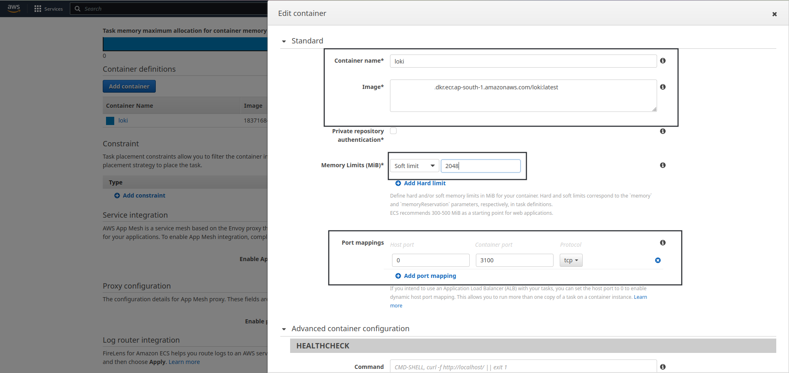

# Deploying Loki With S3 as backend storage in ECS.

## Requirements:
- AWS Account.
- Privileges to modify IAM roles.
- Working ECS Cluster.
- S3 bucket for Loki
- Grafana running. (Not a hard requirement* but important for Integration)

## Steps:
### Create EFS (Elastic File System) to store Grafana Data.
- This step is exactly similar to the grafana one; please refer this [section](01_Deploying_Grafana.md#create-efs-elastic-file-system-to-store-grafana-data) for creating EFS.

### Create/Modify ECS task IAM role so that Loki in ECS can use S3 bucket.
- Go to IAM -> select roles -> Search for ***ecsTaskExecutionRole*** -> Select that role -> Under **Permission Policies** select ***Add permissions*** -> Hit ***Create Inline Policy***

    

- Select json and paste following policy with one minor adjustment which is in place of ***<bucket_name>*** put your s3 bucket name.

    ```json
    {
    "Version": "2012-10-17",
    "Statement": [
        {
            "Sid": "Statement1",
            "Effect": "Allow",
            "Action": [
                "s3:ListBucket",
                "s3:ListAllMyBuckets",
                "s3:GetObject",
                "s3:PutObject",
                "s3:DeleteObject"
            ],
            "Resource": [
                "arn:aws:s3:::<bucket_name>",
                "arn:aws:s3:::<bucket_name>/*"
            ]
        }
    ]
    }
    ```

    Hit ***next*** and then ***Create policy***

### Create Custom docker image for Loki and Uploading it to ECR.
- First Navigate to ECR and hit ***create repository*** (we will be creating private repo here.) -> Keep Visibility Setting ***Private*** -> Give it appropriate name and hit ***Create Repository***.
- Now In your local machine or in any Linux machine create 2 files one being ***Dockerfile*** and ***local-config.yaml*** and add following content.

    Dockefile
    ```docker
    FROM grafana/loki:latest
    COPY local-config.yaml /etc/loki/local-config.yaml
    ```

    local-config.yaml (change 2 values: ***<aws_region>***, ***<bucket_name>***)
    ```yaml
    auth_enabled: false

    server:
      http_listen_port: 3100
      grpc_listen_port: 9096

    ingester:
      wal:
        enabled: true
        dir: /tmp/wal
      lifecycler:
        address: 127.0.0.1
        ring:
          kvstore:
            store: inmemory
          replication_factor: 1
        final_sleep: 0s
  chunk_idle_period: 1h       # Any chunk not receiving new logs    in this time will be flushed
  max_chunk_age: 1h           # All chunks will be flushed when     they hit this age, default is 1h
    #chunk_target_size: 1048576  # Loki will attempt to build chunks up to 1.5MB, flushing first if chunk_idle_period or    max_chunk_age is reached first
      chunk_target_size: 209715200
  chunk_retain_period: 30s    # Must be greater than index read cache TTL if using an index cache (Default index read cache TTL     is 5m)
      max_transfer_retries: 0     # Chunk transfers disabled

    schema_config:
      configs:
        - from: 2020-10-24
          store: boltdb-shipper
          object_store: s3
          schema: v11
          index:
            prefix: index_
            period: 24h

    storage_config:
      boltdb_shipper:
        active_index_directory: /tmp/loki/boltdb-shipper-active
        cache_location: /tmp/loki/boltdb-shipper-cache
    cache_ttl: 24h         # Can be increased for faster    performance over longer query periods, uses more disk space
        resync_interval: 5s
        shared_store: s3
      aws:
    # Change following 2 values
        region: <aws_region>
        bucketnames: <bucket_name>
        s3forcepathstyle: true

    compactor:
      working_directory: /tmp/loki/boltdb-shipper-compactor
      shared_store: filesystem

    limits_config:
      retention_period: 72h
      enforce_metric_name: false
      reject_old_samples: true
      reject_old_samples_max_age: 168h
      max_cache_freshness_per_query: 10m
      split_queries_by_interval: 15m
      # for big logs tune
      per_stream_rate_limit: 512M
      per_stream_rate_limit_burst: 1024M
      cardinality_limit: 200000
      ingestion_burst_size_mb: 1000
      ingestion_rate_mb: 10000
      max_entries_limit_per_query: 1000000
      max_label_value_length: 20480
      max_label_name_length: 10240
      max_label_names_per_series: 300
      max_query_series: 100000

    chunk_store_config:
      max_look_back_period: 0s

    table_manager:
      retention_deletes_enabled: false
      retention_period: 0s

    ruler:
      storage:
        type: local
        local:
          directory: /tmp/loki/rules
      rule_path: /loki/rules-temp
      alertmanager_url: http://localhost:9093
      ring:
        kvstore:
          store: inmemory
      enable_api: true

    query_scheduler:
      max_outstanding_requests_per_tenant: 2048
    ```

- Now build the docker image with the help of ECR for that go to the ECR repo and hit ***View push commands*** and follow the instructions.

    

    Check if the Image is pushed properly or not.

    


### Deploy Loki in ECS.
#### Create Task definition.
- Refer [Grafana deployment](01_Deploying_Grafana.md#create-task-definition-for-grafana) for ECS task definition configuration (ignore EFS setup in that).
- Navigate to ECS -> On left hand pane Select Task Definitions -> Create New task Definition
- Under Select launch type compatibility select appropriate Launch type, Assuming that we are using ASG (Auto Scaling Group as Capacity Provider in the ECS cluster) we will select EC2 -> Hit Next Step.

    

- In the next step we will Configure task and container definitions.
- In the form add appropriate information. Name -> Task Role -> In network mode select Bridge Mode -> Task Execution Role (use default role or create a new IAM role and use that; but make sure if you are using new IAM role select Configure task and container definitions as use case under Elastic Container Service)

    

    Scroll all the way down and select ***Add Volume*** under Volumes section -> Give appropriate name for the volume mount -> Select ***EFS*** as volume type -> Select EFS that we created earlier in the ***File System ID*** -> Mention Root Directory -> Click ***Add***

- After this scroll down and under Container Definitions select Add Container -> A new form will appear -> here give appropriate Container name -> Add docker image name -> in Memory Limits select Soft limit and set memory accordingly for this demo we will set it as 2048 which is 2GiB -> Under port mappings put ***3100*** as Container Port as it is the default port of loki and either put specific port number as Host Port if you are using EC2 instances with Public IP and NOT utilizing ALB but we will be attaching it to ALB so we will set it to 0 which will set the host port dynamically -> 

    
    
    scroll down -> And check the Auto-configure CloudWatch Logs box so that ECS can automatically configure Log options -> Hit Update.

    

    Scroll down and hit Create.

#### Deploy Loki ECS service.
- Refer [Grafana Deployment step](01_Deploying_Grafana.md#deploy-grafana-ecs-service) for this step as most of the steps are exactly the same. With only one minor change; that is in ***Health Check Path*** instead of */api/health* use ***/ready*** which is health check path of loki.

#### Modify ALB Rules.
- This step will be exactly similar as it was in the [Grafana](01_Deploying_Grafana.md#modify-alb-rules), only change is the Host Header parameter which will be DNS of Loki and **NOT** of Grafana.

#### Integrate Loki With Grafana.
- Open Grafana in browser -> Navigate to Connections -> Select Data Sources.

    

- Select “Add new data source” and Search for “Loki” -> Select Loki.

    

- Add loki URL in the URL section. (**Note***: If your loki is using SSL use https instead of http and port, i.e. https://\<loki\>)

    

- Hit ***Save & Test***.