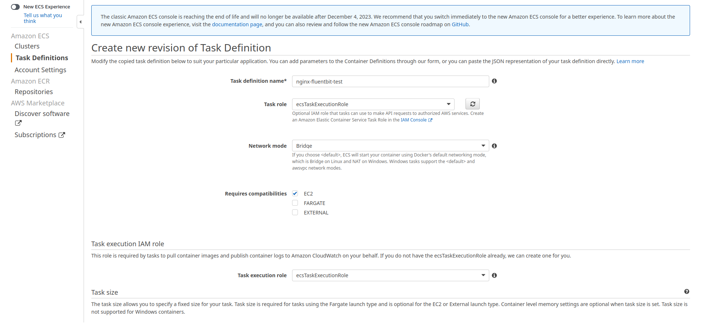
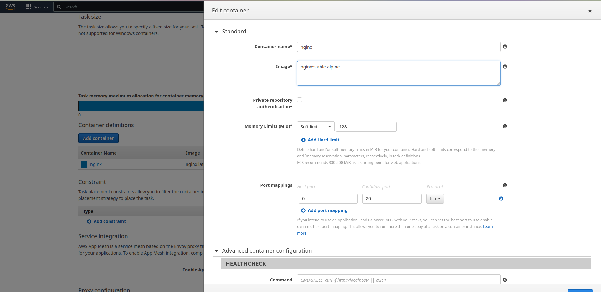
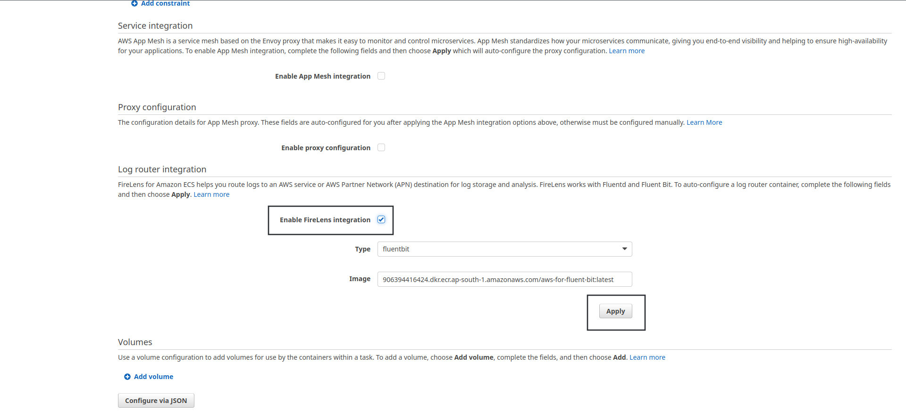
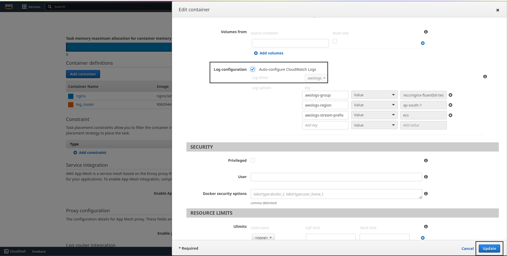
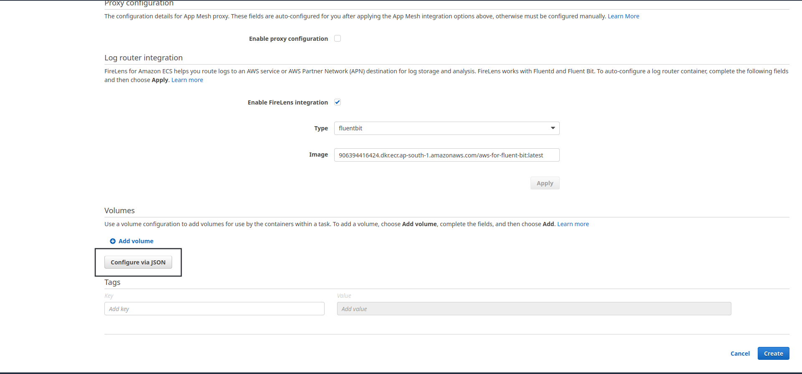
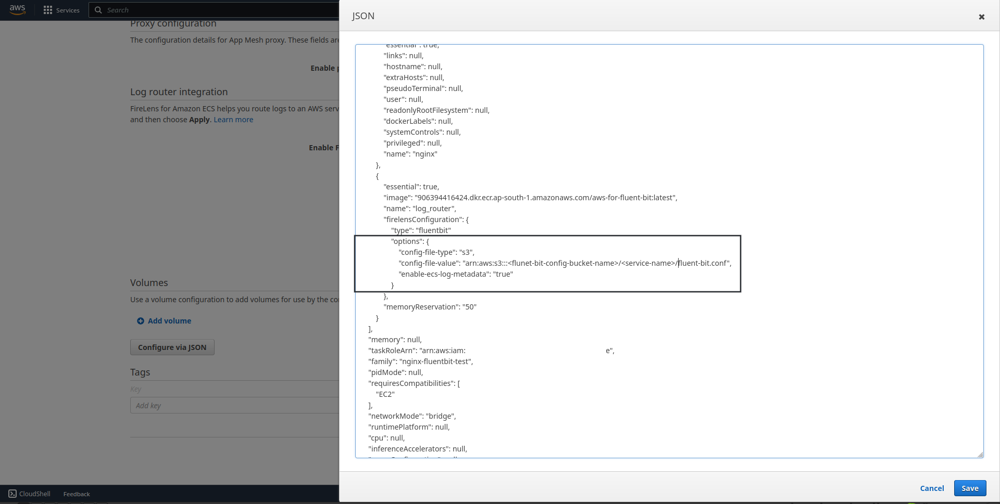
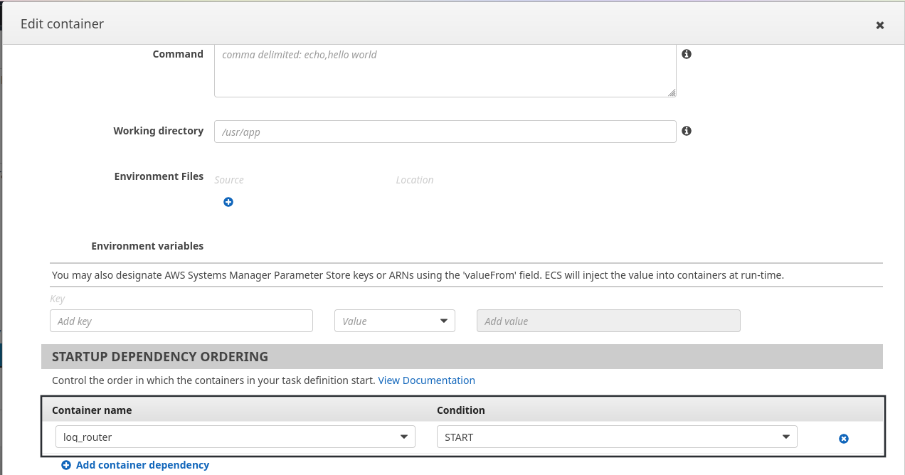
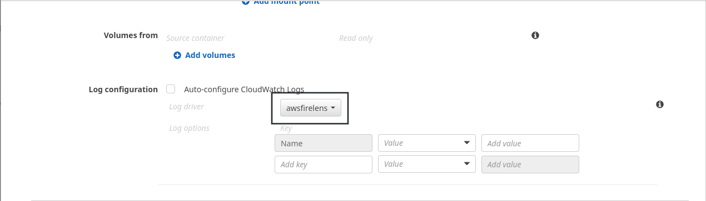
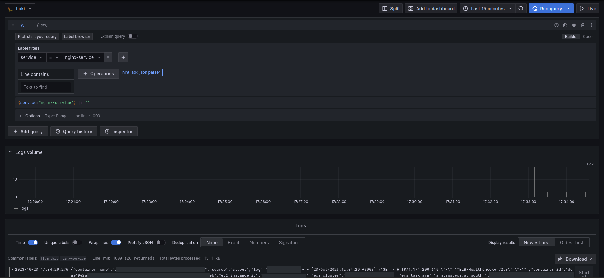

# Deploy and Configure Fluentbit to ship logs to Grafana-Loki in ECS.

## Requirements:
- S3 bucket to store fluentbit config files.
- ECS task role with S3 readonly access. (Basically Attach ***S3 readonly policy*** to the ECS Role.)

## Steps:
### Create Task definition for application with Fluentbit as sidecar container.
- Here we will be using nginx container as it is quite easy and needs less configuration.
- Navigate to ECS -> select task definitions -> Hit **Create new task Definition** -> Add apropriate name, task role and task execution role.

    

- Scroll down -> Add container -> Add appropriate name and docker image URI -> Hit **Update**.

    

- Scroll Down -> Check ***Enable FireLens Integration*** -> Hit ***Apply***. It will add another container named **log_router**.

    

- Scroll Up and select newly added **log_router** -> Scroll down and select *Auto-Configure Cloudwatch Logs* (this step is optional but useful if for some reason fluentbit container crashes then we can debug it.) -> Hit update

    

- After that scroll down and hit ***Configure via JSON*** -> 

    

- Add following lines after the ***"type":"fluentbit"*** in *log_router* block. (One more easier way to identify is look for **"name":"log_router"**)
    **Note***: Create a S3 bucket to store fluentbit config file and put that information in place of <flunet-bit-config-bucket-name> and <service-name> here 

    ```json
    ,
                    "options": {
                    "config-file-type": "s3",
                    "config-file-value": "arn:aws:s3:::<flunet-bit-config-bucket-name>/<service-name>/fluent-bit.conf",
                    "enable-ecs-log-metadata": "true"
                }
    ```
    It should look something like this.

    

- Select nginx container again -> Scroll down -> Under **Startup Dependency Ordering** Select ***log_router*** as the container and ***START*** as condition -> Scroll down -> in Log Configuration select ***awsfirelens*** as Log driver - .Hit update.

    

- Select nginx container once again -> Under Log Configuration remove the Name key as we will be passing conf file instead of passing the parameters as key value. -> Hit ***Update*** -> Hit ***Create***.

    

### Create and upload Fluentbit configuration files.
- Create fluent-bit.conf file in your local machine and add following config.
    ```bash
    [SERVICE]
        parsers_file parsers.conf
        plugins_file plugins.conf
        # HTTP Server
        # ===========
        # Enable/Disable the built-in HTTP Server for metrics
        http_server  Off
        http_listen  0.0.0.0
        http_port    2020

    [FILTER]
        Name        record_modifier
        Match       *
        Record      service                nginx-service

    # If your loki instance is behind HTTP
    [OUTPUT]
        name                   loki
        Match                  *
        host                   <loki_instance_ip>
        port                   3100
        labels                 job=fluentbit, service=nginx-service
        workers                8

    # If your loki instance is behind HTTPS
    [OUTPUT]
        name                   loki
        Match                  *
        host                   <loki_url>
        port                   443
        tls                    on
        tls.verify             on
        labels                 job=fluentbit, service=nginx-service
        workers                8
    ```

- Upload the file to S3; but make sure that the path is similar to the path mentioned in the step earlier.

### Deploy Application Fluentbit ECS Service.
- Refer [Grafana Deployment step](01_Deploying_Grafana.md#deploy-grafana-ecs-service) for this step as most of the steps are exactly the same. With only one minor change; that is in ***Health Check Path*** instead of */api/health* use ***/*** or other path which returns 200.

### Modify ALB Rules.
- This step will be exactly similar as it was in the [Grafana](01_Deploying_Grafana.md#modify-alb-rules), only change is the Host Header parameter which will be DNS of application and **NOT** of Grafana. Also this is not necessary for fluentbit but it is important if application is hosted.

## Output:
  